# Pharmacy Management System

A web-based **Pharmacy Management System** built with PHP and MySQL for managing medicines, inventory, sales, customers, prescriptions, orders, and pharmacy reports.

[](https://www.php.net/) [](https://www.mysql.com/) [](https://mariadb.org/) [](#license)

**Live Demo:** Coming soon · **Source Code:** This repository

---

## Overview

The Pharmacy Management System is a PHP/MySQL web application that combines pharmacy administration with a customer-facing online ordering interface. It provides separate **Admin** and **Customer** workflows for managing medicines, stock, sales, customers, suppliers, prescriptions, online orders, invoices, and sales reports.

## Features

### Admin

* Admin authentication and pharmacy dashboard
* Medicine management and search
* Stock tracking and expiry reminders
* Supplier and customer management
* Sales processing, invoice generation
* Daily and monthly sales reports
* Online order management
* Prescription management

### Customer

* Registration and login
* Medicine search and browsing
* Shopping cart and order placement
* Order history and tracking
* Prescription upload
* Payment/order confirmation

---

## Tech Stack

| Category        | Technology               |
| --------------- | ------------------------ |
| Backend         | PHP                      |
| Database        | MySQL / MariaDB (MySQLi) |
| Frontend        | HTML, CSS, JavaScript    |
| UI              | Custom CSS, Font Awesome |
| Local Server    | XAMPP / Apache           |
| Database Tool   | phpMyAdmin               |

---

## Project Structure

```text
pharmacy/
├── index.html
├── login.php
├── logout.php
├── dashboard.php
├── medicines.php
├── Search.php
├── customers.php
├── suppliers.php
├── stock_tracking.php
├── expiry_reminders.php
├── sell_medicine.php
├── save_sale.php
├── process_sale.php
├── invoice.php
├── reports.php
├── daily_report.php
├── monthly.php
├── sales_report.php
├── admin_orders.php
├── prescription_upload.php
├── confirm_payment.php
├── db.php
├── header.php
├── footer.php
├── images/
├── uploads/
│
├── user/
│   ├── home.php
│   ├── login.php
│   ├── register.php
│   ├── logout.php
│   ├── shop.php
│   ├── cart.php
│   ├── orders.php
│   ├── track_order.php
│   ├── admin_orders.php
│   └── db.php
│
└── pharmacy_db.sql
```

---

## Database

Included SQL dump: `pharmacy_db.sql` → database name `pharmacy_db`

Core data: Admin accounts, Customers, Medicines, Orders, Order items, Prescriptions, Sales, Sales items, Suppliers, Profit/reporting.

Medicine records include: name, generic name, batch number, quantity, cost price, selling price, price per strip, expiry date, and category.

---

## Run Locally

### Requirements

* XAMPP, PHP 8.x, MySQL or MariaDB, Apache, phpMyAdmin, a web browser

### 1. Clone the repository

```bash
git clone https://github.com/YOUR_USERNAME/pharmacy-management-system.git
cd pharmacy-management-system
```

### 2. Start XAMPP

Start Apache and MySQL.

### 3. Place the project

Copy the project into `C:\xampp\htdocs\pharmacy\`. The main application files should be directly inside the `pharmacy` folder.

### 4. Create the database

Open `http://localhost/phpmyadmin`, create a database named `pharmacy_db`, and import `pharmacy_db.sql`.

### 5. Configure the database

Update credentials in `db.php` and `user/db.php`:

```text
Host: localhost
Username: root
Password: [your local password]
Database: pharmacy_db
```

### 6. Run the application

```text
http://localhost/pharmacy/
```

---

## Screenshots

### Home & Auth

| Home Page | Admin Login | User Login |
|---|---|---|
| 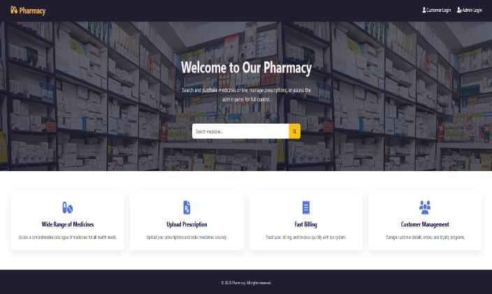 | 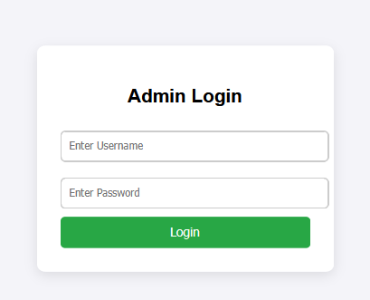 | 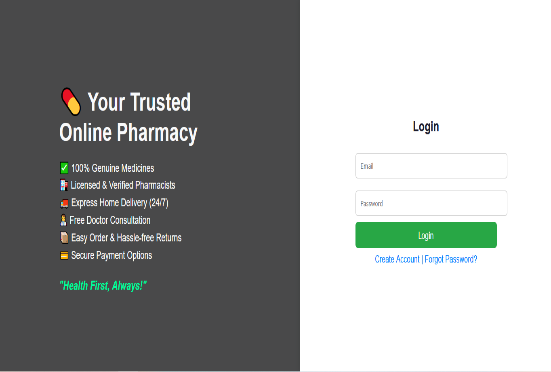 |

### Search & Admin Dashboard

| Search Medicine | Admin Dashboard |
|---|---|
| 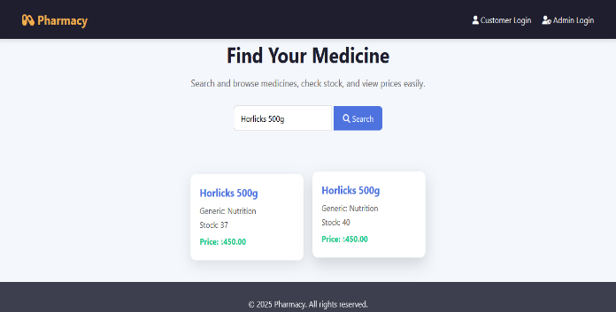 | 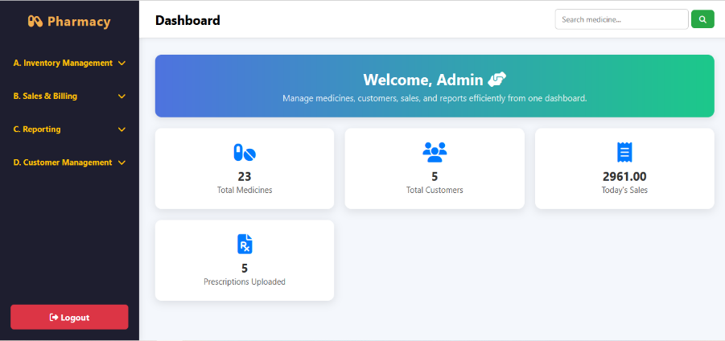 |

### Inventory Management

| Add Medicine | Medicine List | Stock Tracking | Expiry Reminders |
|---|---|---|---|
| 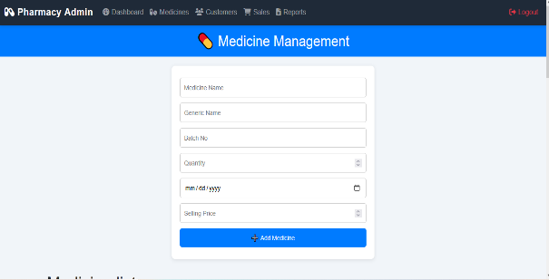 | 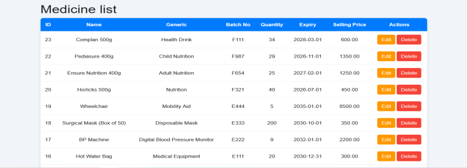 | 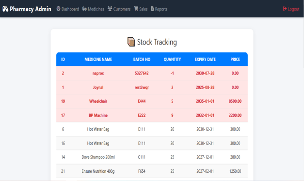 | 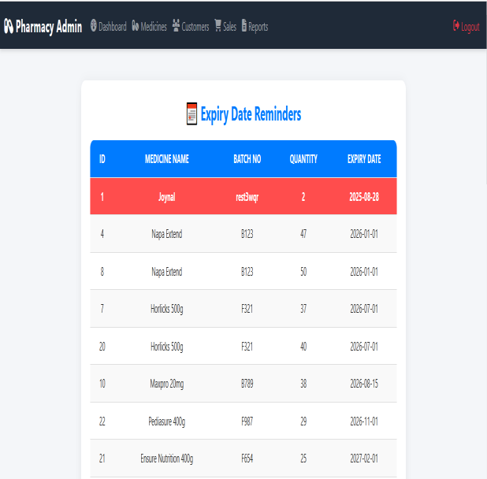 |

### Sales & Billing

| Sell Medicine | Invoice |
|---|---|
| 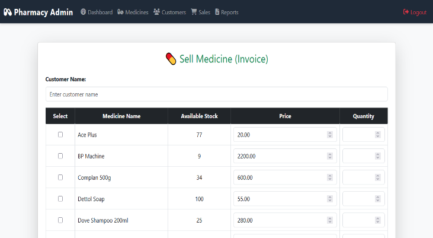 | 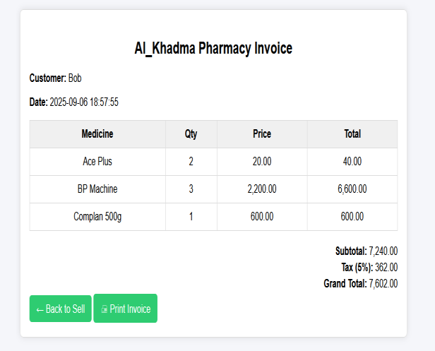 |

### Reports

| Daily Report | Monthly Report | Daily Sales (Bar) | Monthly Sales (Bar) |
|---|---|---|---|
| 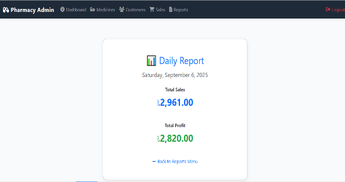 | 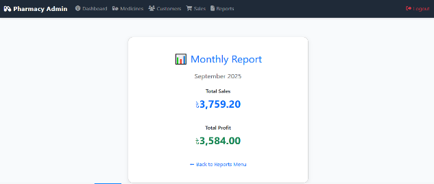 | 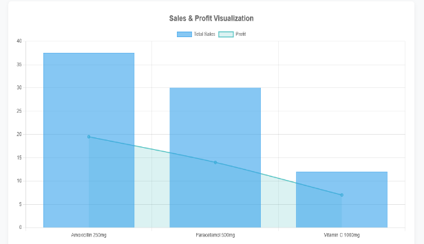 | 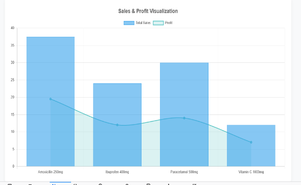 |

### Orders & Customers

| Order Management | Customer Management | Upload Prescription |
|---|---|---|
| 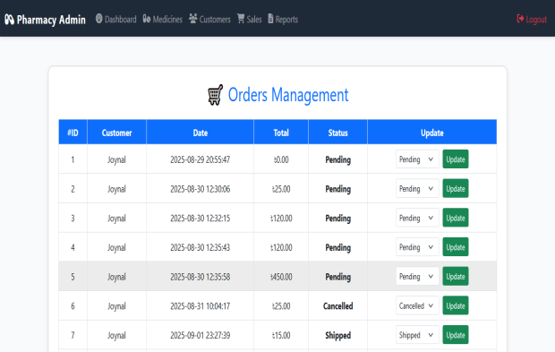 | 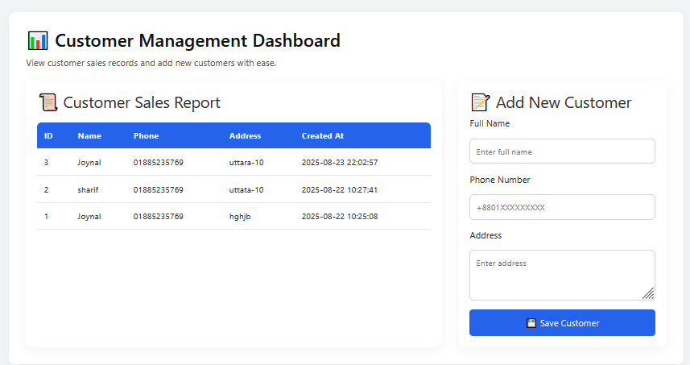 | 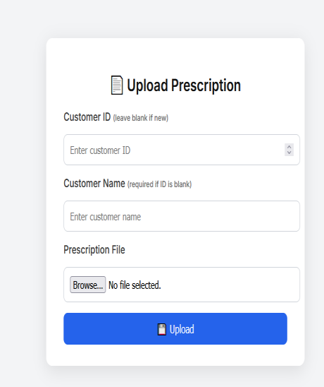 |

### Customer Shopping Experience

| User Dashboard | Shopping Categories | Shopping Cart |
|---|---|---|
| 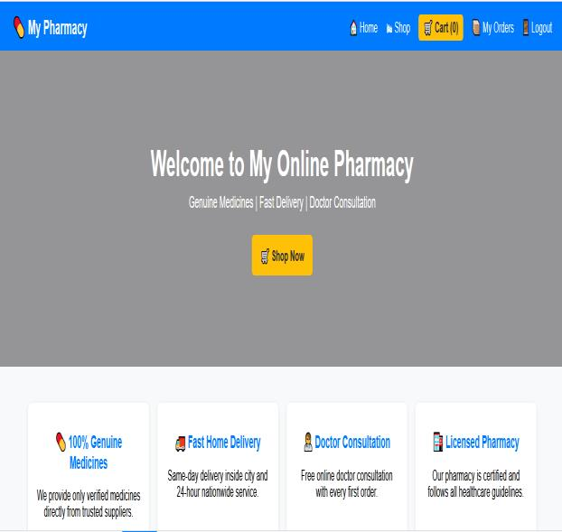 | 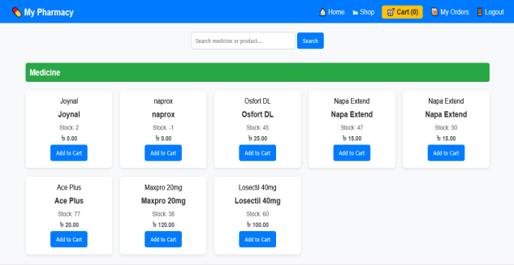 | 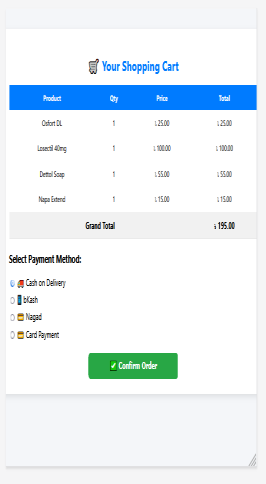 |

| Order Confirmation | Order Tracking |
|---|---|
| 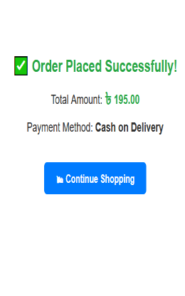 | 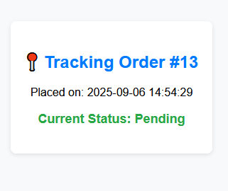 |

---

## Live Demo

Coming soon

## Security

This project was developed as an academic/portfolio application. Before public production deployment:

* Do not publish real database credentials.
* Change all default/admin credentials.
* Remove personal customer information from the database.
* Replace legacy MD5 password storage with `password_hash()` and `password_verify()`.
* Use prepared statements for database queries.
* Validate and restrict prescription/file uploads, with appropriate size limits.
* Use HTTPS in production and disable detailed PHP/database errors publicly.
* Protect sensitive prescription and customer information.

> This project should be security-hardened before being used as a real pharmacy/medical service.

## Future Improvements

* Role-based staff permissions and secure password authentication
* Barcode scanning and automated low-stock alerts
* Online payment gateway, email/SMS order notifications
* Advanced sales analytics and audit logging
* Secure prescription storage, REST API, responsive UI improvements

## License

This project was developed for **academic and portfolio purposes**. Add a formal open-source license if redistribution is intended.

---

<p align="center">
  Built with PHP · MySQL · XAMPP
</p>
